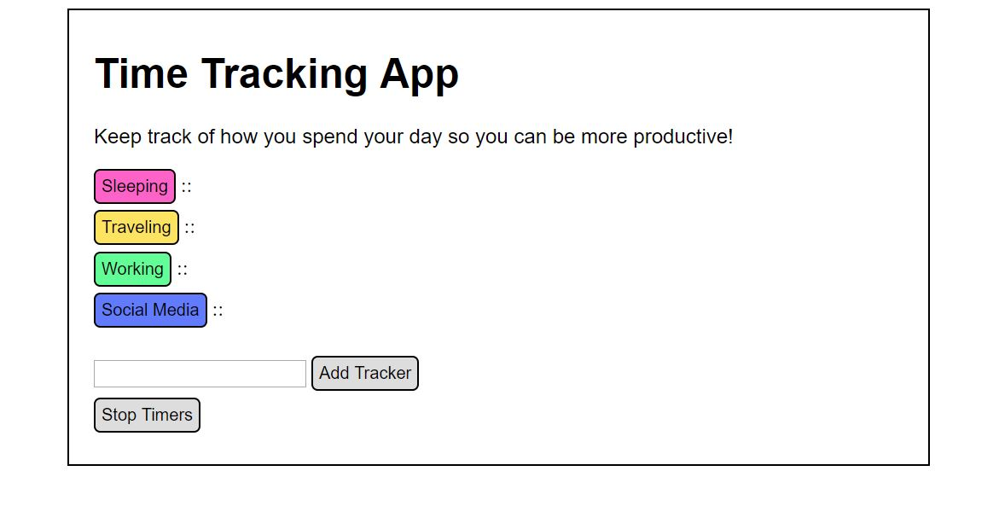

## JQuery

<a href="nicolemoran.github.io/timetracker/time.html">View live project</a>

<a href="https://github.com/nicolemoran/timetracker">View code</a>

This simple JavaScript widget lets the user track how she spends her time. Clicking on an activity starts or adds to a timer, while pausing all other timers. New custom timers can be added at the bottom of the widget. Each new timer is given one of four random colors.

Click "view live project" to try it out or click "view code" to see how it works.

