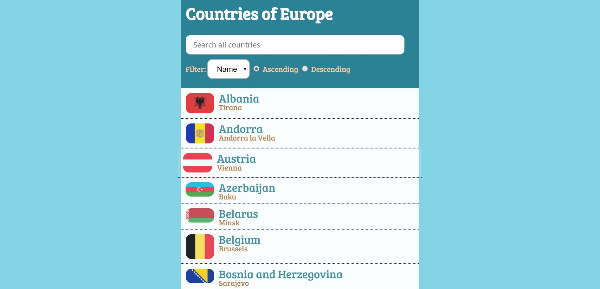

## AngularJS, JQuery, JSON

<a href="nicolemoran.github.io/countries/index.html">View live project</a>

<a href="https://github.com/nicolemoran/countries_of_europe">View code</a>

This single-page web application allows the user to search, sort, and view details about the countries of Europe. All data in this application is dynamically called from a JSON file using AngularJS.

Click "view live project" to see it in action, or click "view code" to see how it works.

