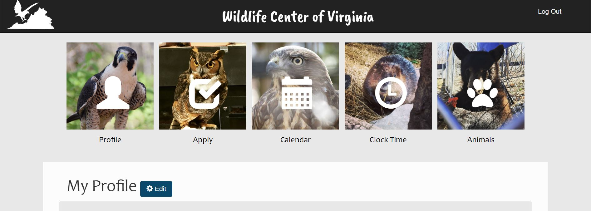

## JavaScript, PHP, Team Project

This database-driven website* was my capstone project at university and the winner of the KPMG Award for System Design and Implementation. Teams of seniors web design and computer information systems were tasked with creating a fully functional website for a client, the Virginia Wildlife Center. Winners were voted on by professors, KPMG representatives, and the client.

The client needed a website to manage their extensive base of volunteers. Our website allows current volunteers to clock in and out, apply for new positions, view upcoming events on the calendar, and edit their profile information. Site administrators can review applications, create calendar events, and assign other users to new positions. Our website also features a "forgot password" function and email reminders about upcoming shifts.

My role on the team was UI design, JavaScript, and making sure the front end and back end worked together smoothly.

<small>*For display purposes, all PHP code on the live proect below has been commented out. This allows you to view the entire website without needing login information or permissions. Some of the buttons such as "edit profile," or submitting any form, will not work either. Click on "view code" to get an idea of how the front end interacted with the database.</small>

<a href="nicolemoran.github.io/wildlife_center/index.html">View Live Project</a>

<a href="">View Code</a>

